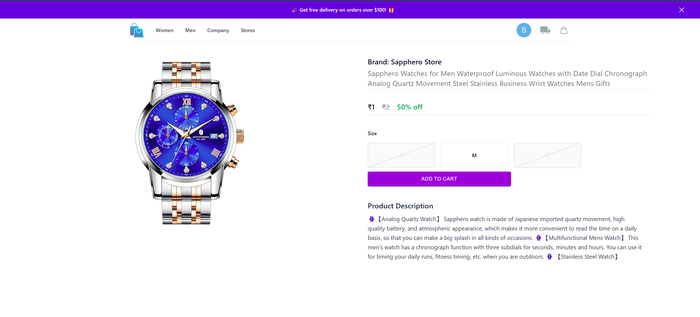
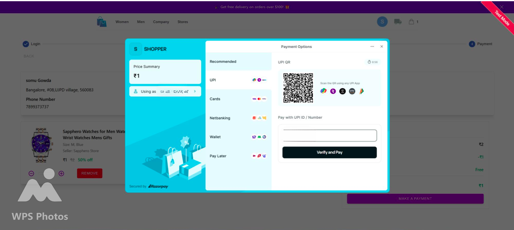
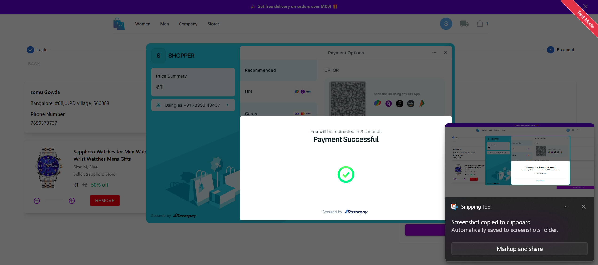

```markdown
# 🛍️ E-Commerce Fashion World - Frontend

Welcome to **E-Commerce Fashion World**, a modern and fully functional e-commerce web application built with **React.js, Tailwind CSS, Redux, and Redux Thunk**.

## 🚀 Live Demo

🔗 [E-Commerce Fashion World](https://ecommerce-fashion-world.netlify.app/)

## 📂 GitHub Repository

🔗 [GitHub - Frontend](https://github.com/somugowdasoft/mern-ecommerce-frontend)

## 🛠️ Technologies Used

- **React.js** - For building the UI components  
- **Tailwind CSS** - For responsive and modern styling  
- **Redux & Redux Thunk** - For state management and handling asynchronous operations  
- **React Router** - For client-side routing  
- **Axios** - For API calls  

## 🎯 Features

✅ View products  
✅ Product details page  
✅ Add products to the cart  
✅ Delete items from the cart  
✅ Buy a product  
✅ Make payments via **UPI, Cards, Razorpay**  

## 🛠️ Installation & Setup

1. **Clone the repository**
   ```bash
   git clone https://github.com/somugowdasoft/mern-ecommerce-frontend.git
   cd mern-ecommerce-frontend
   ```
2. **Install dependencies**
   ```bash
   npm install
   ```
3. **Start the development server**
   ```bash
   npm start
   ```

## 📌 Environment Variables

Create a `.env` file in the root directory and add:

```env
REACT_APP_BACKEND_URL=<Your Backend API URL>
REACT_APP_ROZ_KEY_ID=<Your Razorpay Key>
```

## 📸 Screenshots

### 🏠 Home Page





## 💡 Contributing

Feel free to fork the repository and contribute to the project. Create a pull request with your changes!  

## 📄 License

This project is **open-source** and available under the **MIT License**.

---

🚀 Built with ❤️ by **Somu Gowda**
```

This README includes everything a developer needs: setup, features, technologies, environment variables, and contribution guidelines. Let me know if you need modifications! 🚀
